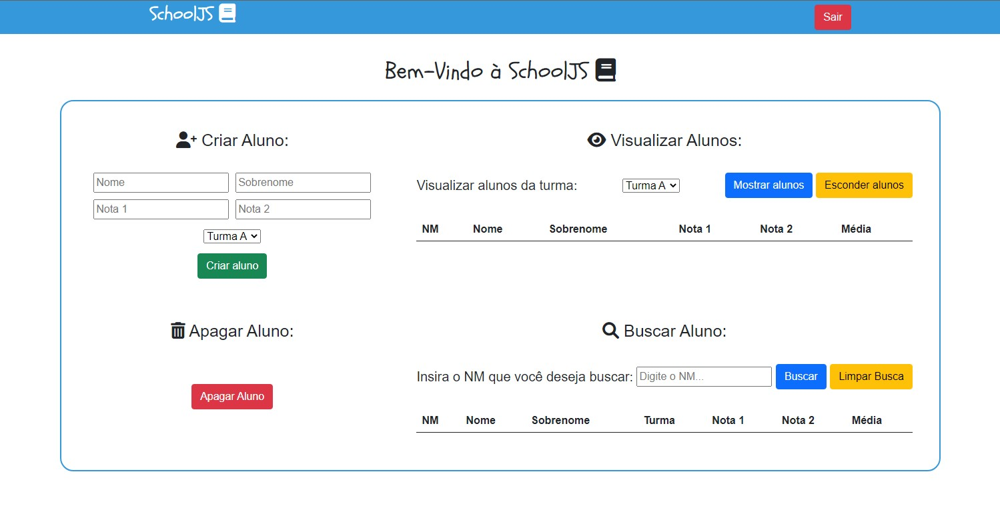
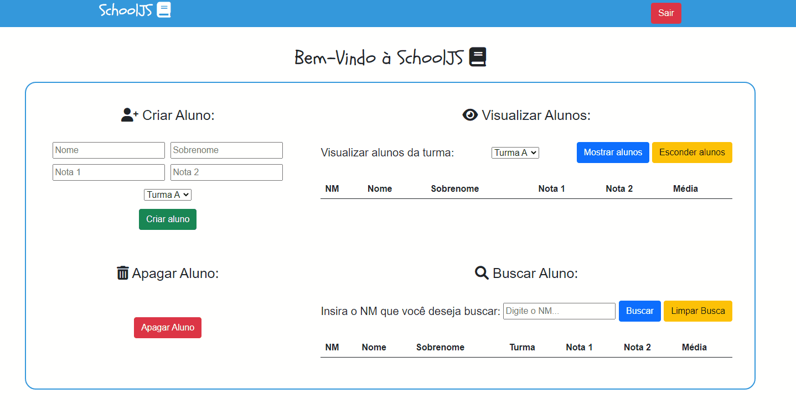
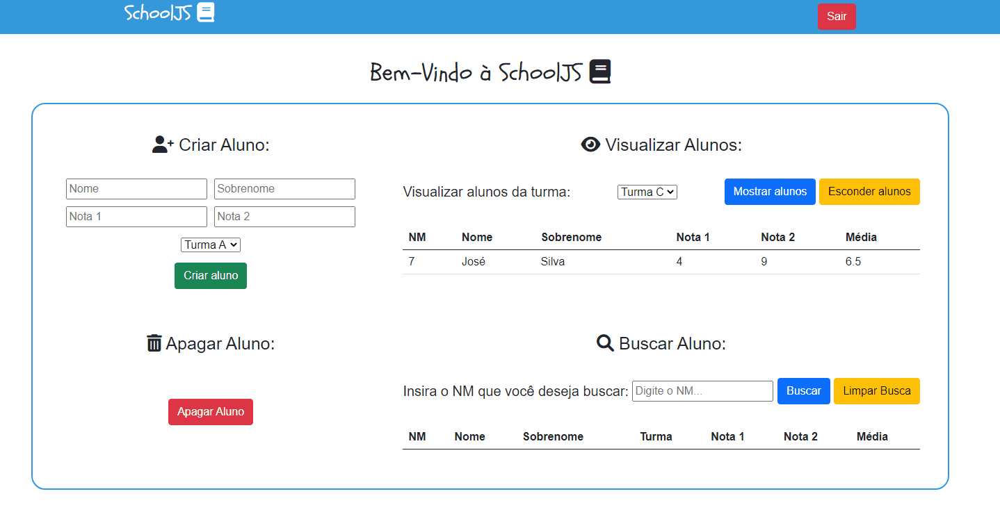

<h1 align="center">SchoolJS</h1>

<h3>Tabela de conteúdos:</h3>
<a href="#sobre"> - Sobre o projeto</a><br>
<a href="#funcionalidades">- Funcionalidades</a><br>
<a href="#acesso">- Onde posso acessar?</a><br>
<a href="#baixar">- Como posso baixar o projeto?</a><br>
<a href="#tecnologias">- Tecnologias usadas</a><br>

<br>
<br>
<h2 id="sobre">Sobre o Projeto:</h2>
<p>Projeto pensado em um sistema de escola para controle de alunos. Voltada para os professores, onde eles podem registrar os alunos e suas notas, buscar por um aluno específico ou por turma e deletar algum aluno caso tenha essa necessidade.</p>

<p>Criado com JavaScript puro e armazenamento dos alunos através do Firebase.</p>




<br><br>

<h2 id="funcionalidades">Funcionalidades:</h2>
<p>Algumas das funcionalidades do projeto serão listadas a seguir:</p>
<br>
<h4>- Criar Aluno:</h4><br>

<br><br>
<h4>- Visualizar alunos por turma:</h4><br>

<br><br>
<h4>- Apagar aluno:</h4><br>

<br><br>
<h4>- Buscar aluno pelo NM:</h4><br>

<br>
<br>

<h2 id="acesso">Onde posso acessar o projeto?</h2>
<br>
<p>O projeto está hospedado no próprio GitHub, para acessar o link a seguir: <a href="https://victorpraado1005.github.io/SchoolJS/">victorpraado1005.github.io/SchoolJS</a></p>
<br>

<h2 id="baixar">Como posso baixar o projeto?<h2>

<h4>Para baixar o projeto basta seguir os próximos passos...</h4>
<br>
<h3> - Pré-requisitos:</h3>
<h4>Para clonar o repositório será necessário ter instalado em sua máquina o Git, após isso recomendo utilizar o VSCode para abrir o projeto, mas o editor fica a sua escolha!</h4>
<br>

```bash
#Clone o repositório
$git clone https://github.com/victorpraado1005/SchoolJS.git
```

<h4>Após clonar o repositório basta abrir o projeto em seu editor preferido e rodar o projeto.</h4>
<br>
<h4>*Não é necessário instalar nenhuma dependência para rodar esse projeto.</h4>
<br>

<h2 id="tecnologias">Tecnologias do projeto:</h2>
<br>
<h4>Para a criação desse projeto foram utilizadas as seguintes tecnologias:</h4>
<h4> - HTML</h4>
<h4> - CSS</h4>
<h4> - Bootstrap</h4>
<h4> - JavaScript</h4>
<h4> - Firebase</h4>
<br>
<h4>Observações:</h4>
<h4>Caso queira contribuir com o projeto com alguma correção ou nova funcionalidade, fique à vontade, o código é aberto e adoraria contar com a sua ajuda!</h4>
<br>
<h2>Autor:</h2>
<br>
<h4>Criado por:  <a href="https://github.com/victorpraado1005"> Victor Prado</a>
</h4>
<br>
<h4>Caso queira entrar em contato ou saber mais sobre minhas atividades profissionais basta acessar o meu <a href="https://www.linkedin.com/in/victorprado1005/">Linkedin.</a></h4>
